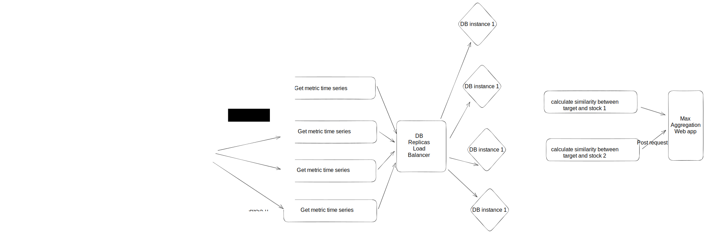

# How to use the app


After installing prerequisites
## Prerequisites:
- docker: [link](https://docs.docker.com/get-docker/)
- docker-compose [link](https://docs.docker.com/compose/install/)
- make: `brew install make` if you are using macos
## Steps
- 1 Create an external volume for the database to persist the data
```
docker volume create db-volume
```
- 2 Populate data to a DB table
```
make run_pipeline
```
This will populate the stock market data to in `stock` table in a postgres database in `stock_market_data` database running locally.

- 3 Run the API:
```
make run_api
```
This will launch a local web app that uses FastAPI and listens on port 8000 locally


## How to query the API and use the app:

- with Curl
```
curl -X 'GET' \
  'http://0.0.0.0:8000/stock_metrics/?ticker=AAPL&start=2010-10-10&end=2010-12-10&price_column=open_price&metric=median&rolling_window=10' \
  -H 'accept: application/json'
```

- Using the url:
http://localhost:8000/stock_metrics/?ticker=GOOG&start=2010-10-10&end=2010-12-10&price_column=open_price&metric=median&rolling_window=1

To try different input values for `ticker`, `start` and `end` dates ... you can change the query parameters values in either the url or with curl.

## Technical choices
The purpose of the app

## Implementation Discussion

1- If you didn’t implement tests, what kind of testing would you like to see for this

Here we would like to test everything:
- The populator, test with a test db that the populator is adding the data and creating the requested indexes.
- We can test the data preprocessing functions to convert the date columns to the ISO format.
- Test the API that is returning the correct answers the and raising the expected errors with the right status codes.


2- How did you handle and validate user inputs?
- There is some input validation implemented and described [here](#input-validation) . But We can extend it by raising 40x Http Errors with good error messages.

3- What optimizations did you make to speed up run-time? What additional
optimizations would you like to make?
- To speed up the run-time when filtering and searching for the target rows based on the ticker and the start and end date, the data was put in a postgres table and added a b-tree index on (name, date) to speed up the search.
- I have added postgres table [clustering](https://www.postgresql.org/docs/14/sql-cluster.html) based on the (name, date) index to make the table phisically reordered based on the index information which helps making less random file access in the DB disk and have maximum sequential access to disk which is faster.\
This can be done with such query `CLUSTER stock USING idx_name_date`
- Since the `rolling-window` is small there is no value in <span id="pre-aggregation"> **`pre-aggregating`**</span> the metrics that we can aggregate on top like `MAX` and `MIN`. \
By pre-aggregation here we mean that:
  - we can pre-aggregate `MIN` and `MAX` for each group of 100 subsequent dates,
  - then to find the `MIN` for 910 dates we just need to aggregate on top of 9 of the pre-aggregated metrics + 10 non pre-aggregated metrics.
  - `STD` and `MEAN` also can be pre-aggregated but need additional data to store to be able to aggregate on top. `Median` can't be pre-aggregated.\

  This will introduces complexity, this can be beneficial only on big amount of data, for example in the case where we have the stock market data for each minute and for a extended number of years.

- Another Techinique to consider is caching, caching some frequent

**Remark**:\
Both `pre-aggregation` and `caching` are used by BI tools for faster dashboarding and fast calculation of aggregations. This layer is generally called a cube (eg: [cube.dev](https://cube.dev/))

4- If it had to serve many queries at once — when would it start to break and how
would you scale past that point?
<span id="many_queries"></span>

Using 1 instance serving the API is already `not fault tolerant`, so when the machine that we use is down, the service will be down, => We need more than 1 instance serving the API.\
If we start receiving thousands of requests per second then 1 instance should break and won't be able to handle that amount of concurrent requests. This will depend on the machine config (CPU) used to run the service and on the cpu resources used by each request. Some load-testing is necessary to have a better idea on the numbers.

- If we start having multiple queries at once we need to scale the app horizontalaly and make more instances running the stateless api service and place a load-balancer in front to load-balance between the instances, such thing is easy to declare and deploy with Kubernetes (using load balancer service) and a deployment behind that will `auto-scale` the Replicaset based on the CPU usage of the pods.

- Use dB connection pools to reduce the time taken to create connections to the db and make connections reusable.

- Use async dB calls and async api functions to have concurrency and not wait for dB calls while returned. This should be out of the box in FasApi.

- If we start hitting the max CPU usage of the database instance due to the large number of connections and the required queries overhead then we can scale use `DB replication` and have 1 primary instance for writing and multiple replicas read-only DB instances that we can load-balance the traffic between. \
This introduces some trandoffs between `availability` and `strong consistency of read after write` . These are the different postgres replication modes:
  - Asynchronous Replication => no strong consistency of read after write
  - Synchronous Write Replication
  - Synchronous Apply Replication => Need that all replicas have written => Slower writes


5 - If it had to serve queries over larger datasets — when would it start to break and how would you scale past that point?

- If we serve the queries over large datasets then we can hit storage scaling problems where we can no more scale vertically our database instance, or we can start having slower queries due to the large search space and reduced DB cache compared to the size of the table and the indexes => We need to read from disk more often.

- Stock market data is a `time-series` data and queries are always based on the time. If we had a stock market data with billions of data points, then using a time-series database like will be a better fit since it optimizes for the time-based queries./
Databases like TimeScaleDB and InfluxDB can be considered.

- We can use DB `partitioning` which will split the table into smaller phisical pieces and if the partitions are matching the queries (partitioning columns are used for filtering) then the queries search space will decrease and make the queries faster. /
We can paritition based on ticker name and dates, Hash Partitioning on names and Range parititioning on dates. This is supported out of the box for [Postgres](https://www.postgresql.org/docs/14/ddl-partitioning.html). /
This introduces some overhead if we end up with large number of partitions.

- Another option is `Database Sharding`. Stock ticker is a good choice for sharding key, where we can use `hashed sharding` since we can consider that each stock ticker have the same amount of data (with exceptions depending on the date the stock started trading), then distributing them randomly `won't create data skew problems` with some shards being bigger then other ones.\
We can use `Consistent hashing` For a better fault tolerant solution, but generally the database will be hosted in the cloud provider's service where it offers `high availability` and shards can be restored fast if some problems occured.\
Sharding can introduces problems if we have joins between different tables that can't be sharded by the same key, which introduces the complexity of performing multi-shards(distributed) transactions.

6 - Additional notes on implementation:

-

### Input validation
For the validation I relied mostly on FastAPI already built in tools for easier HTTP exceptions handling.

Use the FastAPI's `Query` to validate the api endpoint query parameters, which when doesn't correspond will automatically raise a [`Unprocessable Entity`](https://developer.mozilla.org/en-US/docs/Web/HTTP/Status/422) exception with `422` status code.


## Feature Expansion Discussion: Most Similar Stock

- To find the most similar stock based on the computed rolling window metric time series, the basic way is to perform the metric calculation for all stocks and then choose the max based on the similarity measure by some function that implements a way of calculating similarity between time series.

- A basic implemetation of a function to calculate similarity or (-distance) between 2 times series can be based on [`Pearson correlation`](https://en.wikipedia.org/wiki/Pearson_correlation_coefficient), which compares the patterns of fluctuation of the time serie and not the values.

- Here obviously we can't have a pre-built index that we can query and give us the closest time-series, mainly because we can't pre-calculate the metrics for all the stocks for all rolling-window possible numbers.

- To solve the problem of re-calculating the the entire metric based on the rolling window we can use `pre-aggreation` and caching as described [here](#pre-aggregation). This will allow to have the metric time-series of each.

- One property of the problem at hand is that it can be `performed in parallel`. Once the target stock metric time series is calculated, both calculating the metric time series and the similarity to the target stock's one can be done for each stock in parallel. At the end we need to `aggregate` the results and return the max value.\
If we use `spark` such aggregation can be done easily in the driver.

- We can distribute the work with technologies like `spark` or `dask`. We can also leverage An event based architecture where we create an event for each stock in a queue (AMAZON SQS or Tasks queue on GCP) and cloud functions (or cloud run) that will be triggered based on the queue content to calculate the metric and then the similarity and send the result to an aggregation service that can be a simple web app that caculates the maximum similarity on the fly based on the incoming post requests.\
The end choice of the technology will depend on the costs of different cloud infrastructure parts and the size of the data at hand.

- We can hit some bottelneck in terms of the number of connections to the DB, but we can use the techniques described [above](#many_queries) to serve many queries at once like connection pools and replication for the DB and horizontal scaling for the web app.

- This scheme illustrates the idea of distributing the calculation.


## Next steps:
- Add test coverage for the API and better input validation with more detailed error messages.
- Add Continuous integration (CI) with Github actions to run all unit tests at each commit.
